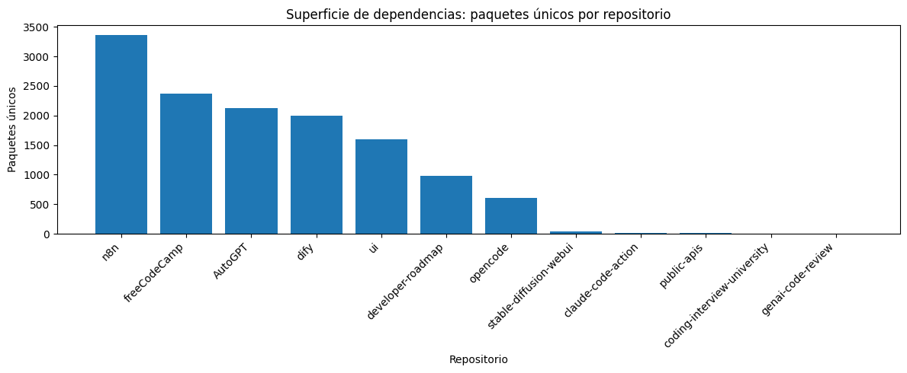
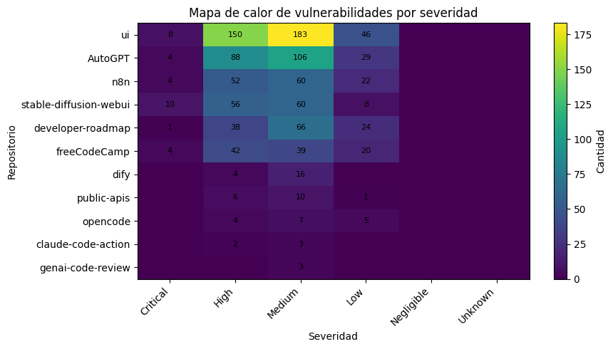
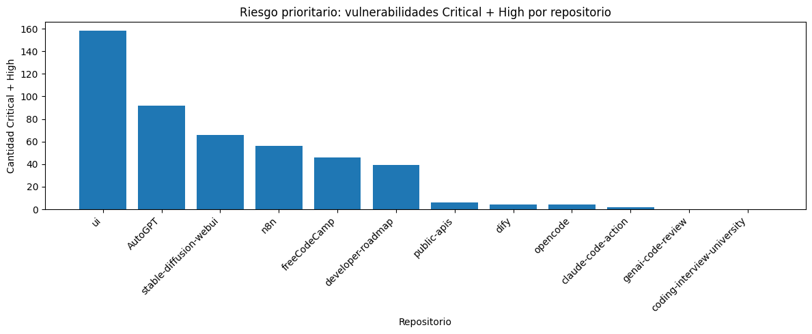
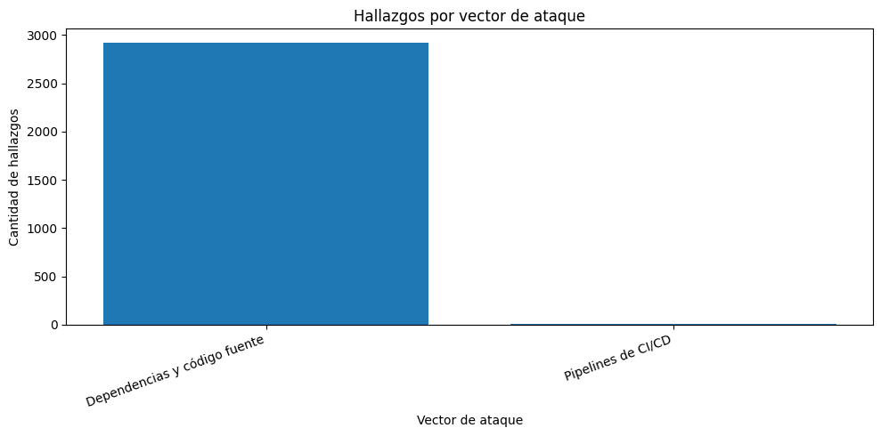
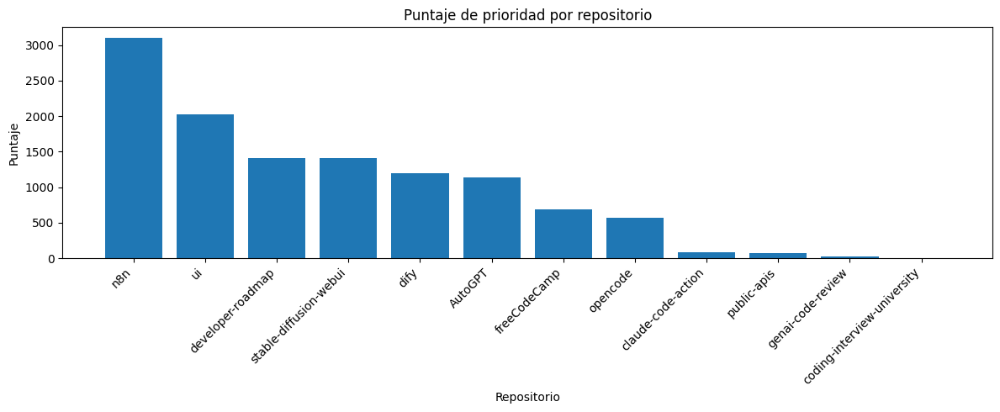
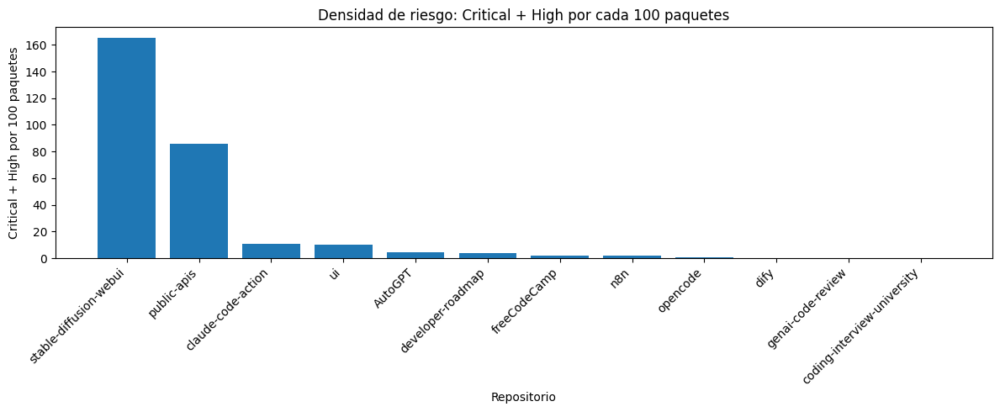
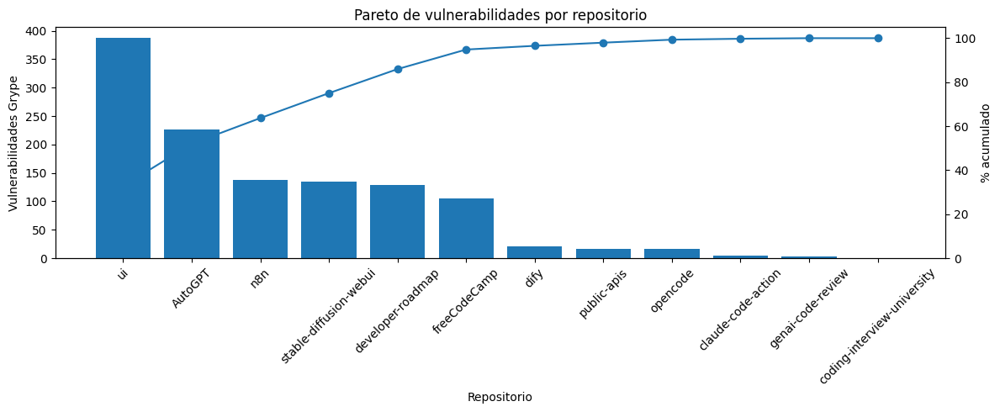

# Propuesta de gestión de vulnerabilidades en cadena de suministro de software

## 1. Resumen ejecutivo

Este repositorio presenta una propuesta para gestionar vulnerabilidades encontradas en una colección de repositorios de software. El análisis se construyó a partir de SBOMs, reportes de vulnerabilidades en dependencias, hallazgos CodeQL/SARIF y tablas consolidadas generadas mediante notebooks y scripts de apoyo.

La pregunta central que guía la propuesta es:

> **¿Cómo debería gestionar el equipo las vulnerabilidades encontradas, considerando su origen, su evidencia y el nivel de riesgo que representan?**

A partir de los datos consolidados, se analizaron **12 repositorios**, con **13118 paquetes únicos**, **19842 paquetes totales**, **1181 vulnerabilidades detectadas por Grype** y **1740 hallazgos CodeQL/SARIF**. Dentro de las vulnerabilidades Grype se identificaron **31 Critical**, **442 High**, **553 Medium** y **155 Low**. En conjunto, existen **473 vulnerabilidades Critical/High**, por lo que la propuesta prioriza primero los hallazgos con mayor severidad, evidencia concreta y posibilidad de mitigación verificable.

Los repositorios que aparecen como más relevantes para la gestión inicial son:

| repo | vulnerabilidades_criticas_altas | vulnerabilidades_grype | paquetes_unicos | hallazgos_codeql | puntaje_prioridad |
| --- | --- | --- | --- | --- | --- |
| ui | 158 | 387 | 1596 | 121 | 2028.96 |
| AutoGPT | 92 | 227 | 2122 | 57 | 1135.22 |
| stable-diffusion-webui | 66 | 134 | 40 | 197 | 1404.40 |
| n8n | 56 | 138 | 3363 | 633 | 3097.63 |
| freeCodeCamp | 46 | 105 | 2374 | 63 | 684.74 |
| developer-roadmap | 39 | 129 | 980 | 241 | 1409.80 |
| public-apis | 6 | 17 | 7 | 2 | 74.07 |
| dify | 4 | 20 | 2001 | 277 | 1200.01 |
| opencode | 4 | 16 | 606 | 129 | 567.06 |
| claude-code-action | 2 | 5 | 19 | 16 | 85.19 |

La propuesta no busca corregir automáticamente todas las alertas, sino definir un proceso razonado para pasar desde los datos técnicos hacia decisiones de mitigación basadas en evidencia.

---

## 2. Contexto del análisis

La actividad se basa en tres etapas previas:

1. Generación de SBOMs para identificar componentes, dependencias y tipos de paquetes.
2. Extracción de vulnerabilidades desde dependencias usando Grype.
3. Consolidación de hallazgos de código fuente y/o reportes CodeQL/SARIF cuando estaban disponibles.

El flujo seguido fue:

```text
Repositorio de software
        ↓
Extracción de componentes y resultados de herramientas
        ↓
Consolidación en CSVs y notebooks
        ↓
Análisis de severidad, exposición, vectores y evidencia
        ↓
Priorización y propuesta de acciones
```

Este enfoque transforma reportes técnicos en información útil para tomar decisiones de seguridad. Por eso, el README no solo lista vulnerabilidades: también explica cómo se verifican, cómo se priorizan y qué acciones deberían tomarse.

---

## 3. Repositorios analizados y herramientas utilizadas

### 3.1 Herramientas y artefactos

| Herramienta / artefacto | Propósito | Evidencia generada |
|---|---|---|
| SBOM / Syft | Identificar componentes y dependencias de cada repositorio | `data/results/*-sbom.json`, `data/results/resumen/resumen_sbom.csv` |
| Grype | Detectar vulnerabilidades en dependencias y componentes | `data/results/*-grype-raw.json`, `data/results/resumen/resumen_grype.csv` |
| CodeQL/SARIF | Identificar hallazgos asociados a código fuente o análisis estático | `data/results/*-codeql.json`, `data/results/*_temp.sarif`, `data/results/resumen/comparacion_priorizacion.csv` |
| Notebook de análisis | Consolidar tablas, priorización y ciclo de decisión | `notebooks/notebook_ciberseguridad_mejorado.ipynb` |
| Notebook de gráficas | Generar visualizaciones para README y presentación | `notebooks/notebook_graficas_datascience_ciberseguridad.ipynb` |
| CSVs consolidados | Permitir revisión y trazabilidad de resultados | `data/results/resumen/*.csv` |

### 3.2 Superficie de dependencias

La SBOM permite estimar la superficie de ataque de cada repositorio. Un repositorio con más dependencias no es automáticamente más riesgoso, pero sí requiere mayor control, porque aumenta la cantidad de componentes que deben mantenerse, verificarse y actualizarse.

| repo | paquetes_totales | paquetes_unicos | tipos |
| --- | --- | --- | --- |
| n8n | 5001 | 3363 | github-action, github-action-workflow, npm, python, terraform |
| freeCodeCamp | 2867 | 2374 | github-action, github-action-workflow, npm |
| AutoGPT | 2631 | 2122 | github-action, npm, python |
| dify | 2160 | 2001 | github-action, github-action-workflow, npm, php-composer, python |
| ui | 4657 | 1596 | github-action, npm |
| developer-roadmap | 1647 | 980 | github-action, npm |
| opencode | 775 | 606 | github-action, rust-crate |
| stable-diffusion-webui | 46 | 40 | github-action, python |

**Interpretación:** `n8n`, `freeCodeCamp`, `AutoGPT`, `dify` y `ui` presentan una superficie de dependencias amplia. Esto no implica que todos deban corregirse primero, pero sí que requieren monitoreo continuo, revisión de lockfiles y actualización periódica de componentes.



---

## 4. Vulnerabilidades encontradas

### 4.1 Distribución general por severidad

La siguiente tabla resume las vulnerabilidades Grype por repositorio y severidad:

| repo | Critical | High | Medium | Low | Negligible | Unknown |
| --- | --- | --- | --- | --- | --- | --- |
| AutoGPT | 4 | 88 | 106 | 29 | 0 | 0 |
| claude-code-action | 0 | 2 | 3 | 0 | 0 | 0 |
| developer-roadmap | 1 | 38 | 66 | 24 | 0 | 0 |
| dify | 0 | 4 | 16 | 0 | 0 | 0 |
| freeCodeCamp | 4 | 42 | 39 | 20 | 0 | 0 |
| genai-code-review | 0 | 0 | 3 | 0 | 0 | 0 |
| n8n | 4 | 52 | 60 | 22 | 0 | 0 |
| opencode | 0 | 4 | 7 | 5 | 0 | 0 |
| public-apis | 0 | 6 | 10 | 1 | 0 | 0 |
| stable-diffusion-webui | 10 | 56 | 60 | 8 | 0 | 0 |
| ui | 8 | 150 | 183 | 46 | 0 | 0 |

El total consolidado muestra:

| Severidad | Cantidad |
|---|---:|
| Critical | 31 |
| High | 442 |
| Medium | 553 |
| Low | 155 |



### 4.2 Repositorios con mayor cantidad de Critical/High

Para priorizar, se consideran primero las vulnerabilidades **Critical** y **High**, porque tienen mayor potencial de impacto. Bajo este criterio, los repositorios más relevantes son:

| repo | grype_critical | grype_high | vulnerabilidades_criticas_altas | vulnerabilidades_grype | paquetes_unicos |
| --- | --- | --- | --- | --- | --- |
| ui | 8 | 150 | 158 | 387 | 1596 |
| AutoGPT | 4 | 88 | 92 | 227 | 2122 |
| stable-diffusion-webui | 10 | 56 | 66 | 134 | 40 |
| n8n | 4 | 52 | 56 | 138 | 3363 |
| freeCodeCamp | 4 | 42 | 46 | 105 | 2374 |
| developer-roadmap | 1 | 38 | 39 | 129 | 980 |
| public-apis | 0 | 6 | 6 | 17 | 7 |
| dify | 0 | 4 | 4 | 20 | 2001 |
| opencode | 0 | 4 | 4 | 16 | 606 |
| claude-code-action | 0 | 2 | 2 | 5 | 19 |



### 4.3 Principales vulnerabilidades críticas

Las siguientes vulnerabilidades aparecen como casos prioritarios porque tienen severidad Critical, paquete afectado, versión instalada, versión corregida o ubicación específica:

| repo | vulnerabilidad | severidad | paquete | version_instalada | version_corregida | tipo_paquete | ubicacion |
| --- | --- | --- | --- | --- | --- | --- | --- |
| AutoGPT | GHSA-h526-wf6g-67jv | Critical | @orval/core | 7.13.0 | 7.19.0 | npm | /autogpt_platform/frontend/pnpm-lock.yaml |
| AutoGPT | GHSA-jjhc-v7c2-5hh6 | Critical | litellm | 1.80.0 | 1.83.0 | python | /classic/poetry.lock |
| AutoGPT | GHSA-mwr6-3gp8-9jmj | Critical | @orval/mcp | 7.13.0 | 7.18.0 | npm | /autogpt_platform/frontend/pnpm-lock.yaml |
| AutoGPT | GHSA-xq3m-2v4x-88gg | Critical | protobufjs | 7.5.4 | 7.5.5 | npm | /autogpt_platform/frontend/pnpm-lock.yaml |
| developer-roadmap | GHSA-fjxv-7rqg-78g4 | Critical | form-data | 4.0.2 | 4.0.4 | npm | /pnpm-lock.yaml |
| freeCodeCamp | GHSA-cpq7-6gpm-g9rc | Critical | cipher-base | 1.0.4 | 1.0.5 | npm | /pnpm-lock.yaml |
| freeCodeCamp | GHSA-fjxv-7rqg-78g4 | Critical | form-data | 4.0.2 | 4.0.4 | npm | /pnpm-lock.yaml |
| freeCodeCamp | GHSA-m7jm-9gc2-mpf2 | Critical | fast-xml-parser | 4.2.5 | 4.5.4 | npm | /pnpm-lock.yaml |
| freeCodeCamp | GHSA-rpr9-rxv7-x643 | Critical | sanitize-html | 2.17.3 | 2.17.4 | npm | /pnpm-lock.yaml |
| n8n | GHSA-248r-7h7q-cr24 | Critical | vm2 | 3.11.2 | 3.11.3 | npm | /pnpm-lock.yaml |
| n8n | GHSA-2w6w-674q-4c4q | Critical | handlebars | 4.7.8 | 4.7.9 | npm | /.github/scripts/pnpm-lock.yaml |
| n8n | GHSA-67hx-6x53-jw92 | Critical | @babel/traverse | 7.21.4 | 7.23.2 | npm | /packages/@n8n/tournament/pnpm-lock.yaml |

**Interpretación:** la mayoría de estos casos tiene una versión corregida identificada. Por lo tanto, son buenos candidatos para acciones verificables: actualizar dependencia, ejecutar pruebas y repetir el escaneo.

---

## 5. Clasificación según vector de ataque

La gestión se organiza usando tres vectores de ataque:

1. **Dependencias y código fuente**
2. **Pipelines de CI/CD**
3. **Humanos y proceso**

### 5.1 Resumen de hallazgos por vector

| vector_ataque | fuente | severidad | cantidad |
| --- | --- | --- | --- |
| Dependencias y código fuente | CodeQL/SARIF | Unknown | 1740 |
| Dependencias y código fuente | Grype | Medium | 553 |
| Dependencias y código fuente | Grype | High | 440 |
| Dependencias y código fuente | Grype | Low | 155 |
| Dependencias y código fuente | Grype | Critical | 30 |
| Pipelines de CI/CD | Grype | High | 2 |
| Pipelines de CI/CD | Grype | Critical | 1 |



### 5.2 Dependencias y código fuente

Este vector concentra la mayor parte de los hallazgos. Incluye vulnerabilidades detectadas en paquetes npm, Python, acciones tratadas como componentes, lockfiles, manifests y archivos de configuración.

Ejemplos relevantes:

- `@orval/core`, `@orval/mcp`, `protobufjs` y `litellm` en `AutoGPT`.
- `form-data`, `cipher-base`, `fast-xml-parser` y `sanitize-html` en `freeCodeCamp`.
- `vm2`, `handlebars` y `@babel/traverse` en `n8n`.
- `transformers`, `gradio`, `pillow` y `pytorch-lightning` en `stable-diffusion-webui`.
- `next`, `basic-ftp` y `handlebars` en `ui`.

La gestión de este vector debe centrarse en:

- verificar si el paquete aparece en la SBOM;
- revisar si la versión vulnerable está en uso real;
- confirmar si existe versión corregida;
- actualizar dependencias;
- ejecutar pruebas;
- repetir el escaneo para verificar mitigación.

### 5.3 Pipelines de CI/CD

Este vector considera riesgos asociados a workflows, acciones de terceros, permisos, secretos y automatizaciones.

En los resultados aparece al menos un caso crítico relacionado con CI/CD:

| Repo | Vulnerabilidad | Paquete / acción | Severidad | Ubicación |
|---|---|---|---|---|
| `n8n` | `GHSA-69fq-xp46-6x23` | `aquasecurity/trivy-action` | Critical | `/.github/workflows/security-trivy-scan-callable.yml` |

Este hallazgo es relevante porque afecta una acción usada dentro de un workflow. En este caso, la propuesta no debe limitarse a “actualizar la acción”: también se debe revisar el contexto del pipeline, los permisos declarados, los secretos disponibles y el alcance del workflow.

Acciones recomendadas para CI/CD:

- revisar workflows afectados en `.github/workflows/`;
- comprobar permisos explícitos del workflow;
- verificar si el workflow tiene acceso a secretos;
- actualizar acciones vulnerables cuando exista versión corregida;
- justificar cualquier decisión de fijar versión, usar commit SHA, reemplazar acción o mantener versión actual;
- repetir análisis después de la modificación.

> Nota: la fijación de versiones o commits en acciones de GitHub no debe proponerse como receta universal. Debe justificarse con evidencia del caso, el tipo de acción, el riesgo identificado y el impacto esperado.

### 5.4 Humanos y proceso

El vector humano no aparece siempre como CVE o alerta técnica, pero es transversal. Las herramientas detectan hallazgos, pero el equipo debe decidir:

- qué vulnerabilidades son realmente aplicables;
- qué se corrige primero;
- quién es responsable;
- qué plazo tiene cada tipo de hallazgo;
- cuándo se acepta temporalmente un riesgo;
- cómo se documenta la evidencia;
- cómo se verifica que la acción funcionó.

Riesgos humanos identificados:

| Riesgo humano / proceso | Efecto posible | Control propuesto |
|---|---|---|
| No revisar alertas Critical/High | Permanencia de vulnerabilidades explotables | SLA y responsables |
| Actualizar dependencias sin pruebas | Ruptura funcional | Pruebas automatizadas y rollback |
| Aceptar alertas sin validación | Priorización incorrecta | Verificación con SBOM, lockfiles y uso real |
| No documentar excepciones | Pérdida de trazabilidad | Registro de riesgos aceptados |
| Secretos o permisos excesivos en workflows | Exposición del pipeline | Revisión de permisos y secretos |
| No repetir escaneos | Falsa sensación de mitigación | Reescaneo posterior a cambios |

---

## 6. Análisis Conozco → Verifico → Evidencio → Decido y Actúo

El ciclo de análisis usado en la propuesta es:

```text
Conozco → Verifico → Evidencio → Decido y Actúo
```

La tabla completa está disponible en:

```text
data/results/resumen/ciclo_conozco_verifico_evidencio_decido.csv
```

A continuación se presentan casos representativos:

| repo | hallazgo | vector | conozco | verifico | evidencio | decido_y_actuo |
| --- | --- | --- | --- | --- | --- | --- |
| AutoGPT | GHSA-h526-wf6g-67jv | Dependencias y código fuente | Se detectó GHSA-h526-wf6g-67jv con severidad Critical en el paquete @orval/core. | Confirmar que la versión instalada aparece en la SBOM y revisar si el paquete se usa en una parte ejecutable o expuesta del sistema. | Evidencia en data/results/AutoGPT-grype-raw.json. Versión instalada: 7.13.0. Ubicación: /autogpt_platform/frontend/pnpm-lock.yaml. | Actualizar el paquete a una versión corregida: 7.19.0, ejecutar pruebas y volver a escanear con Grype. |
| AutoGPT | GHSA-jjhc-v7c2-5hh6 | Dependencias y código fuente | Se detectó GHSA-jjhc-v7c2-5hh6 con severidad Critical en el paquete litellm. | Confirmar que la versión instalada aparece en la SBOM y revisar si el paquete se usa en una parte ejecutable o expuesta del sistema. | Evidencia en data/results/AutoGPT-grype-raw.json. Versión instalada: 1.80.0. Ubicación: /classic/poetry.lock. | Actualizar el paquete a una versión corregida: 1.83.0, ejecutar pruebas y volver a escanear con Grype. |
| AutoGPT | GHSA-mwr6-3gp8-9jmj | Dependencias y código fuente | Se detectó GHSA-mwr6-3gp8-9jmj con severidad Critical en el paquete @orval/mcp. | Confirmar que la versión instalada aparece en la SBOM y revisar si el paquete se usa en una parte ejecutable o expuesta del sistema. | Evidencia en data/results/AutoGPT-grype-raw.json. Versión instalada: 7.13.0. Ubicación: /autogpt_platform/frontend/pnpm-lock.yaml. | Actualizar el paquete a una versión corregida: 7.18.0, ejecutar pruebas y volver a escanear con Grype. |
| AutoGPT | GHSA-xq3m-2v4x-88gg | Dependencias y código fuente | Se detectó GHSA-xq3m-2v4x-88gg con severidad Critical en el paquete protobufjs. | Confirmar que la versión instalada aparece en la SBOM y revisar si el paquete se usa en una parte ejecutable o expuesta del sistema. | Evidencia en data/results/AutoGPT-grype-raw.json. Versión instalada: 7.5.4. Ubicación: /autogpt_platform/frontend/pnpm-lock.yaml. | Actualizar el paquete a una versión corregida: 7.5.5, ejecutar pruebas y volver a escanear con Grype. |
| developer-roadmap | GHSA-fjxv-7rqg-78g4 | Dependencias y código fuente | Se detectó GHSA-fjxv-7rqg-78g4 con severidad Critical en el paquete form-data. | Confirmar que la versión instalada aparece en la SBOM y revisar si el paquete se usa en una parte ejecutable o expuesta del sistema. | Evidencia en data/results/developer-roadmap-grype-raw.json. Versión instalada: 4.0.2. Ubicación: /pnpm-lock.yaml. | Actualizar el paquete a una versión corregida: 4.0.4, ejecutar pruebas y volver a escanear con Grype. |
| freeCodeCamp | GHSA-cpq7-6gpm-g9rc | Dependencias y código fuente | Se detectó GHSA-cpq7-6gpm-g9rc con severidad Critical en el paquete cipher-base. | Confirmar que la versión instalada aparece en la SBOM y revisar si el paquete se usa en una parte ejecutable o expuesta del sistema. | Evidencia en data/results/freeCodeCamp-grype-raw.json. Versión instalada: 1.0.4. Ubicación: /pnpm-lock.yaml. | Actualizar el paquete a una versión corregida: 1.0.5, ejecutar pruebas y volver a escanear con Grype. |
| freeCodeCamp | GHSA-fjxv-7rqg-78g4 | Dependencias y código fuente | Se detectó GHSA-fjxv-7rqg-78g4 con severidad Critical en el paquete form-data. | Confirmar que la versión instalada aparece en la SBOM y revisar si el paquete se usa en una parte ejecutable o expuesta del sistema. | Evidencia en data/results/freeCodeCamp-grype-raw.json. Versión instalada: 4.0.2. Ubicación: /pnpm-lock.yaml. | Actualizar el paquete a una versión corregida: 4.0.4, ejecutar pruebas y volver a escanear con Grype. |
| freeCodeCamp | GHSA-m7jm-9gc2-mpf2 | Dependencias y código fuente | Se detectó GHSA-m7jm-9gc2-mpf2 con severidad Critical en el paquete fast-xml-parser. | Confirmar que la versión instalada aparece en la SBOM y revisar si el paquete se usa en una parte ejecutable o expuesta del sistema. | Evidencia en data/results/freeCodeCamp-grype-raw.json. Versión instalada: 4.2.5. Ubicación: /pnpm-lock.yaml. | Actualizar el paquete a una versión corregida: 4.5.4, ejecutar pruebas y volver a escanear con Grype. |

### Interpretación del ciclo

- **Conozco:** se identifica la vulnerabilidad, el paquete afectado, la severidad y el repositorio.
- **Verifico:** se confirma si la versión vulnerable aparece en SBOM, lockfile, workflow o archivo de configuración.
- **Evidencio:** se registra el reporte, archivo afectado, versión instalada y ubicación.
- **Decido y Actúo:** se define si corresponde actualizar, reemplazar, mitigar, monitorear o documentar excepción.

Este ciclo evita que la gestión dependa únicamente de la severidad reportada por una herramienta. La decisión final combina severidad, aplicabilidad, evidencia y contexto.

---

## 7. Priorización de vulnerabilidades

### 7.1 Criterios de priorización

La priorización considera:

| Criterio | Pregunta que responde | Evidencia |
|---|---|---|
| Severidad | ¿Qué tan grave es el hallazgo? | `resumen_grype.csv` |
| Exposición | ¿El componente está en código ejecutable, workflow o configuración relevante? | `top_vulnerabilidades.csv`, reportes originales |
| Volumen | ¿Cuántas vulnerabilidades concentra el repositorio? | `comparacion_priorizacion.csv` |
| Superficie | ¿Cuántos paquetes únicos contiene? | `resumen_sbom.csv` |
| Densidad de riesgo | ¿Cuántas Critical/High existen por cada 100 paquetes? | `comparacion_priorizacion.csv` |
| Evidencia disponible | ¿Existe archivo, versión y ubicación verificable? | reportes Grype, SBOM, SARIF |
| Mitigabilidad | ¿Existe versión corregida o acción concreta? | `top_vulnerabilidades.csv` |

### 7.2 Priorización por puntaje consolidado

El puntaje de prioridad combina vulnerabilidades Critical, High, Medium, hallazgos CodeQL/SARIF y superficie de dependencias. No reemplaza el juicio técnico, pero ordena la revisión inicial.

| repo | puntaje_prioridad | vulnerabilidades_criticas_altas | vulnerabilidades_grype | hallazgos_codeql | paquetes_unicos |
| --- | --- | --- | --- | --- | --- |
| n8n | 3097.63 | 56 | 138 | 633 | 3363 |
| ui | 2028.96 | 158 | 387 | 121 | 1596 |
| developer-roadmap | 1409.80 | 39 | 129 | 241 | 980 |
| stable-diffusion-webui | 1404.40 | 66 | 134 | 197 | 40 |
| dify | 1200.01 | 4 | 20 | 277 | 2001 |
| AutoGPT | 1135.22 | 92 | 227 | 57 | 2122 |
| freeCodeCamp | 684.74 | 46 | 105 | 63 | 2374 |
| opencode | 567.06 | 4 | 16 | 129 | 606 |



### 7.3 Priorización por densidad de riesgo

La densidad de riesgo muestra cuántas vulnerabilidades Critical/High existen por cada 100 paquetes únicos. Esto ayuda a detectar repositorios pequeños pero con alta concentración relativa de riesgo.

| repo | vulnerabilidades_criticas_altas | paquetes_unicos | densidad_ch_100 | vulnerabilidades_grype |
| --- | --- | --- | --- | --- |
| stable-diffusion-webui | 66 | 40 | 165 | 134 |
| public-apis | 6 | 7 | 85.71 | 17 |
| claude-code-action | 2 | 19 | 10.53 | 5 |
| ui | 158 | 1596 | 9.90 | 387 |
| AutoGPT | 92 | 2122 | 4.34 | 227 |
| developer-roadmap | 39 | 980 | 3.98 | 129 |
| freeCodeCamp | 46 | 2374 | 1.94 | 105 |
| n8n | 56 | 3363 | 1.67 | 138 |



**Interpretación:** `stable-diffusion-webui` tiene pocos paquetes únicos en comparación con repositorios grandes, pero presenta una densidad muy alta de vulnerabilidades Critical/High. En contraste, `n8n` tiene la mayor superficie de dependencias y alto puntaje consolidado, pero menor densidad relativa. Por eso la priorización debe combinar volumen absoluto y riesgo relativo.

### 7.4 Pareto de vulnerabilidades

El análisis Pareto permite observar si pocos repositorios concentran gran parte de las vulnerabilidades.



**Interpretación:** los primeros repositorios del ranking concentran una parte importante de los hallazgos. Por eso, enfocar la mitigación inicial en `ui`, `AutoGPT`, `n8n`, `stable-diffusion-webui`, `developer-roadmap` y `freeCodeCamp` puede reducir rápidamente una proporción significativa del riesgo observado.

### 7.5 Niveles de prioridad propuestos

| Nivel | Criterio | Repositorios / casos | Acción |
|---|---|---|---|
| P0 — Mitigar ahora | Critical/High con evidencia concreta y versión corregida | `ui`, `AutoGPT`, `stable-diffusion-webui`, `n8n` | Actualizar, probar y reescanear |
| P1 — Corto plazo | High/Medium con impacto probable o alto puntaje | `developer-roadmap`, `freeCodeCamp`, `dify`, `opencode` | Plan de remediación por sprint |
| P2 — Planificado | Medium/Low, deuda técnica o baja exposición | repositorios con bajo Critical/High | Actualizar en ciclo de mantenimiento |
| P3 — Monitoreo | Sin vulnerabilidades críticas o con evidencia limitada | `coding-interview-university`, hallazgos no aplicables | Monitorear y documentar |

---

## 8. Acciones propuestas

### 8.1 Acciones inmediatas sobre dependencias

1. Corregir vulnerabilidades Critical y High con versión corregida disponible.
2. Revisar lockfiles y manifests afectados:
   - `pnpm-lock.yaml`
   - `package-lock.json`
   - `poetry.lock`
   - `requirements.txt`
   - `requirements_versions.txt`
3. Actualizar primero paquetes con evidencia clara de versión instalada y versión corregida.
4. Ejecutar pruebas automatizadas después de cada actualización.
5. Repetir escaneo con Grype.
6. Registrar el resultado posterior a la mitigación.

### 8.2 Acciones sobre pipelines de CI/CD

1. Revisar workflows que aparecen como ubicación de vulnerabilidad.
2. Revisar permisos del workflow.
3. Revisar uso de secretos.
4. Actualizar acciones vulnerables cuando exista versión corregida.
5. Evaluar reemplazo de acciones de terceros si no existe mantenimiento o versión segura.
6. Justificar técnicamente cualquier decisión de pinning, actualización o reemplazo.
7. Reejecutar análisis después de modificar el pipeline.

### 8.3 Acciones humanas y de proceso

1. Definir responsables de seguridad por repositorio.
2. Establecer SLA de respuesta:
   - Critical: 24 a 72 horas.
   - High: hasta 7 días.
   - Medium: hasta 30 días.
   - Low: siguiente ciclo de mantenimiento.
3. Exigir revisión de cambios en dependencias.
4. Documentar riesgos aceptados temporalmente.
5. Mantener evidencia reproducible.
6. Automatizar generación de reportes.
7. Revisar periódicamente dependencias nuevas y acciones de CI/CD.

### 8.4 Automatización propuesta

El proceso puede automatizarse parcialmente o casi completamente:

```text
Clonar / actualizar repositorios
        ↓
Generar SBOM
        ↓
Ejecutar Grype y CodeQL/SARIF
        ↓
Consolidar resultados en CSV
        ↓
Generar gráficas y priorización
        ↓
Crear reporte técnico
        ↓
Revisar manualmente decisiones de mitigación
```

La automatización sirve para detectar, consolidar y priorizar. Sin embargo, la decisión final debe incluir revisión humana, porque hay que confirmar aplicabilidad, impacto, exposición y riesgo residual.

---

## 9. Evidencia utilizada

| Evidencia | Descripción | Uso |
|---|---|---|
| `data/results/resumen/resumen_sbom.csv` | Paquetes totales, paquetes únicos y tipos de componentes | Superficie de dependencias |
| `data/results/resumen/resumen_grype.csv` | Vulnerabilidades por severidad y repositorio | Análisis de severidad |
| `data/results/resumen/comparacion_priorizacion.csv` | Métricas consolidadas, puntaje y ranking | Priorización |
| `data/results/resumen/top_vulnerabilidades.csv` | Vulnerabilidades principales con paquete, versión y ubicación | Casos críticos |
| `data/results/resumen/resumen_vectores.csv` | Clasificación inicial por vector de ataque | Análisis por vector |
| `data/results/resumen/ciclo_conozco_verifico_evidencio_decido.csv` | Trazabilidad entre hallazgo, verificación, evidencia y acción | Ciclo de decisión |
| `data/results/*-sbom.json` | SBOMs originales | Validación de componentes |
| `data/results/*-grype-raw.json` | Reportes Grype originales | Evidencia técnica detallada |
| `data/results/*-codeql.json` / `*_temp.sarif` | Hallazgos CodeQL/SARIF | Evidencia de código fuente |
| `evidence/graficas/*.png` | Visualizaciones del análisis | README y presentación |
| `notebooks/*.ipynb` | Notebooks de procesamiento y gráficos | Reproducibilidad |

---

## 10. Limitaciones del análisis

1. **La severidad no equivale automáticamente a explotabilidad.** Una vulnerabilidad Critical puede no ser explotable si el paquete no se usa en ejecución o no está expuesto.
2. **Los hallazgos CodeQL/SARIF aparecen con severidad `Unknown` en la consolidación.** Por eso se consideran como evidencia complementaria, no como único criterio de priorización.
3. **Puede existir diferencia entre cantidad absoluta y densidad de riesgo.** Repositorios pequeños pueden tener alta densidad de Critical/High aunque tengan pocos paquetes.
4. **La detección automática puede producir falsos positivos o hallazgos no aplicables.** Por eso se requiere la etapa de verificación.
5. **Las acciones sobre CI/CD requieren contexto.** No toda recomendación genérica, como fijar versiones o commits, debe aplicarse sin revisar evidencia e impacto.
6. **La propuesta no reemplaza una auditoría manual completa.** Sirve como proceso de gestión inicial basado en evidencia.

---

## 11. Organización esperada del repositorio

Se recomienda mantener la siguiente estructura:

```text
entrega-ciberseguridad/
├── README.md
├── data/
│   ├── repos.json
│   └── results/
│       ├── *-sbom.json
│       ├── *-grype.json
│       ├── *-grype-raw.json
│       ├── *-codeql.json
│       ├── *_temp.sarif
│       └── resumen/
│           ├── resumen_sbom.csv
│           ├── resumen_grype.csv
│           ├── comparacion_priorizacion.csv
│           ├── top_vulnerabilidades.csv
│           ├── resumen_vectores.csv
│           └── ciclo_conozco_verifico_evidencio_decido.csv
├── evidence/
│   ├── graficas/
│   ├── capturas/
│   └── logs/
├── notebooks/
│   ├── notebook_ciberseguridad_mejorado.ipynb
│   └── notebook_graficas_datascience_ciberseguridad.ipynb
├── scripts/
│   └── analisis.py
└── presentation/
    └── guion_video.md
```

---

## 12. Guion sugerido para presentación oral o video

Duración sugerida: 5 a 10 minutos.

1. **Contexto:** se analizaron repositorios usando SBOM, Grype y CodeQL/SARIF.
2. **Evidencia:** mostrar CSVs, reportes originales y gráficas.
3. **Hallazgos principales:** explicar repositorios con más Critical/High.
4. **Vectores:** dependencias/código, CI/CD y humanos.
5. **Ciclo:** presentar 2 o 3 casos Conozco → Verifico → Evidencio → Decido y Actúo.
6. **Priorización:** explicar P0, P1, P2 y P3.
7. **Acciones:** actualizar, probar, reescanear, revisar workflows y definir responsables.
8. **Cierre:** explicar cómo la propuesta reduce riesgo.

Gráficas recomendadas para la presentación:

- `vulnerabilidades_criticas_altas.png`
- `Densidad_de_riesgo.png`
- `Mapa_de_calor_vulnerabilidades_por_severidad.png`
- `Pareto_vulnerabilidades_por_repositorio.png`

---

## 13. Conclusiones

El análisis muestra que la gestión de vulnerabilidades debe priorizarse según evidencia y contexto, no solo por cantidad de alertas. Los repositorios con mayor concentración de vulnerabilidades Critical/High son candidatos para mitigación inmediata, especialmente cuando existe versión corregida y ubicación clara en lockfiles, requirements o workflows.

La propuesta recomienda comenzar por `ui`, `AutoGPT`, `stable-diffusion-webui` y `n8n`, porque concentran una parte importante del riesgo observado. También se deben revisar `developer-roadmap`, `freeCodeCamp`, `dify` y `opencode` como parte de un plan de corto plazo.

La reducción del riesgo se logra mediante cuatro acciones coordinadas:

1. **Actualizar dependencias vulnerables.**
2. **Verificar aplicabilidad e impacto real.**
3. **Revisar workflows, permisos y secretos en CI/CD.**
4. **Establecer un proceso humano de seguimiento, responsables y plazos.**

En consecuencia, la propuesta convierte los resultados de herramientas en una estrategia de gestión: conocer las vulnerabilidades, verificarlas, evidenciarlas y actuar según prioridad.
